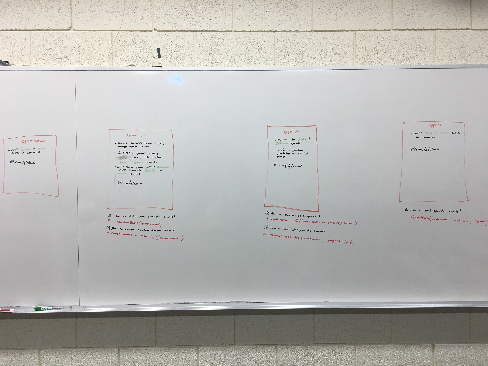
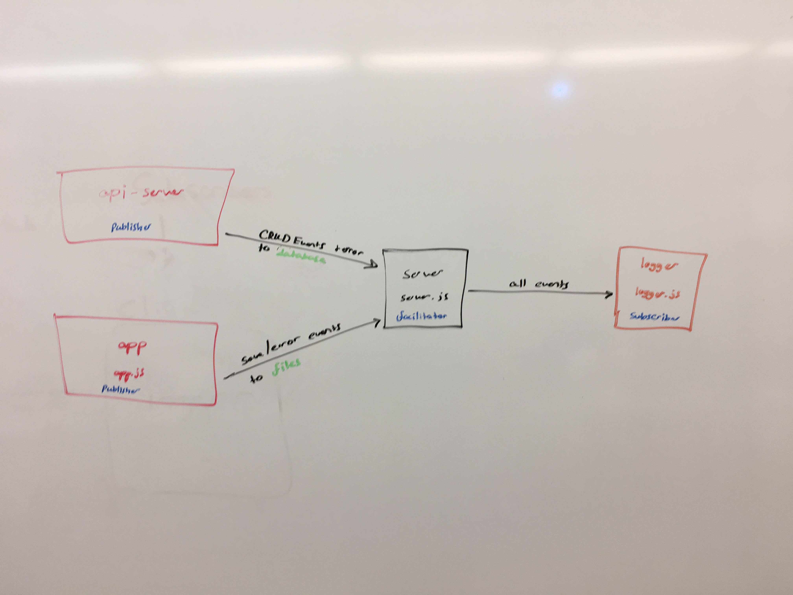

# LAB - 19

## Socket.io - Message Queue Server

### Author: Michael

### Links and Resources
* [submission PR](https://github.com/michaelchapman-401-advanced-javascript/lab-19-api-server/pull/1)
* [travis](https://travis-ci.org/michaelchapman-401-advanced-javascript/lab-19-api-server)

### Modules
#### `index.js`
##### API endpoints

### Setup
#### `.env` requirements
* Q_SERVER

#### Running the app
* `node server.js`
Endpoint: /database
  Returns emits CRUD and error events to server

#### Tests
* npm test

#### UML

